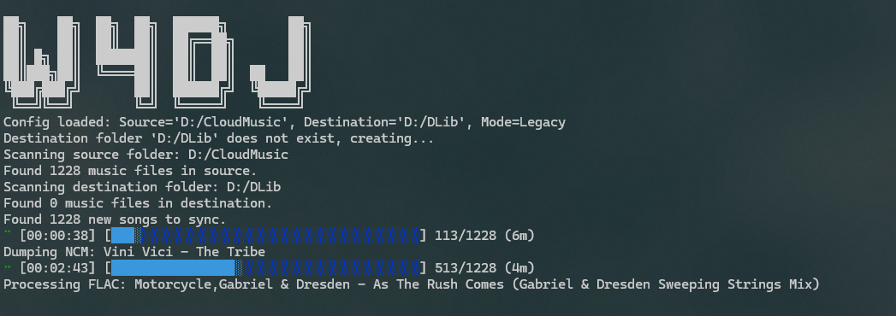

# W4DJ 网易云曲库同步工具

W4DJ 是一个简单的命令行工具，用于同步网易云音乐（Netease Cloud Music）下载目录至自己曲库，且支持将 NCM 格式转换为标准音频格式。

## 功能特点

- 🎵 扫描并同步网易云音乐下载的歌曲
- 🔄 自动识别并转换 NCM 加密格式为 MP3直出或原格式输出
- 📁 支持自定义源目录和目标目录
- ⚡ rayon多线程处理，快速同步大量文件
- 🚀 rust编写，内存占用极低



## 安装

### 1.从源码构建

1. 确保已安装 [Rust 工具链](https://www.rust-lang.org/tools/install)
2. 克隆仓库：
   ```bash
   git clone https://github.com/Slipstream-Max/w4dj.git
   cd w4dj
   ```
3. 构建项目：
   ```bash
   cargo build --release
   ```
4. 可执行文件将位于 `target/release/w4dj`
5. 安装ffmpeg<br>
Windows:
```bash
winget install "FFmpeg (Essentials Build)"
```
Linux:
```bash
sudo apt install ffmpeg
```
Mac:
```bash
brew install ffmpeg
```

### 2.见Release
解压后设置config.toml 双击运行

## 使用方法


### 1. 创建配置文件 `config.toml`：<br>
Windows路径需要`/`隔开

1. 歌曲同步器
   ```toml
   source = "/path/to/netmusic/songs"       # 网易云音乐下载目录
   destination = "/path/to/music/library"   # 目标音乐库目录
   mode = "default"                         # 同步模式，default为原格式输出模式
   ```

2. 歌曲同步器（MP3）
   ```toml
   source = "/path/to/netmusic/songs"       # 网易云音乐下载目录
   destination = "/path/to/music/library"   # 目标音乐库目录
   mode = "legacy"                          # 同步模式，legacy仅输出mp3
   ```

3. 歌曲转换器
   ```toml
   source = "/path/to/netmusic/songs"       # 待转换的目录
   destination = "/path/to/music/library"   # 待输出目录
   mode = "legacy"                          # legacy仅输出mp3
   ```


### 2.运行程序：

双击exe。

   或指定配置文件路径：
   ```bash
   ./w4dj --config /path/to/your/config.toml
   ```

### 3.程序将自动：
   - 扫描源目录和目标目录
   - 识别新增的歌曲
   - 转换 NCM 格式并复制到目标目录
   - 显示同步进度和结果


## 致谢

 - [anonymous5l/ncmdump](https://github.com/anonymous5l/ncmdump)
 - [iqiziqi/ncmdump.rs](https://github.com/iqiziqi/ncmdump.rs)

## 免责声明

本工具仅用于个人学习和技术研究目的。请确保您遵守相关法律法规，仅同步您拥有合法使用权的音乐文件。
