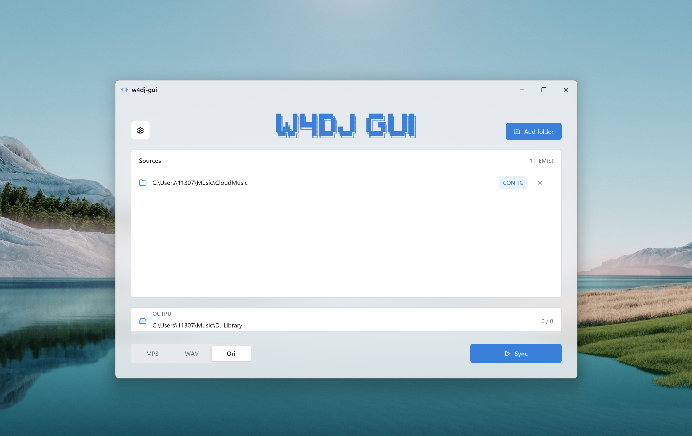

```text
██╗    ██╗██╗  ██╗██████╗      ██╗     ██████╗ ██╗   ██╗██╗
██║    ██║██║  ██║██╔══██╗     ██║    ██╔════╝ ██║   ██║██║
██║ █╗ ██║███████║██║  ██║     ██║    ██║  ███╗██║   ██║██║
██║███╗██║╚════██║██║  ██║██   ██║    ██║   ██║██║   ██║██║
╚███╔███╔╝     ██║██████╔╝╚█████╔╝    ╚██████╔╝╚██████╔╝██║
 ╚══╝╚══╝      ╚═╝╚═════╝  ╚════╝      ╚═════╝  ╚═════╝ ╚═╝
```



[暗色模式](imgs\w4dj-gui-dark.png)

# W4DJ GUI

W4DJ GUI 是一个用于整理和增量同步云音乐下载曲库的工具。

给 W4DJ GUI 若干输入文件或目录和一个输出目录，它会扫描支持的音频，解密 NCM，按照指定模式复制或转码，并把结果增量同步到输出曲库。同步后的文件会保留标题、歌手、专辑、曲号、流派和封面等元数据。

当前支持 NCM、MP3、FLAC 和 WAV 输入，提供图形界面和 CLI 两种使用方式。

## 工作方式

```text
多个 input 文件/目录
        │
        ▼
扫描并识别歌曲 ID
        │
        ▼
与 output 中的 manifest 和真实文件比较
        │
        ├─ 已同步且无需更新 ── 跳过
        ├─ 输出被移动 ──────── 认领新位置并跳过
        ├─ 输出被删除 ──────── 恢复
        └─ 新歌/模式变化/同文件音质升级 ── 解密或转码
```

- 支持同时输入多个文件和目录
- 支持空格、中文、Windows 长路径和拖拽路径
- 使用 Rayon 并行扫描、解密和转换
- NCM 解密后输出内部真实的 MP3 或 FLAC
- 可以保持原格式，或统一转换为 MP3/WAV
- 转换结果保留元数据、封面和稳定的 `W4DJ_ID`
- 所有结果先写临时文件，验证成功后再原子发布

## 安装

从 [GitHub Releases](https://github.com/Slipstream-Max/w4dj/releases) 下载适合当前系统和 CPU 架构的 W4DJ。

下载并解压后，建议先在命令行安装并检查 FFmpeg：

```powershell
w4dj doctor --install
```

Windows 如果没有把 W4DJ 加入 `PATH`，可以在程序所在目录运行：

```powershell
.\w4dj.exe doctor --install
```

Linux 和 macOS 可以运行：

```bash
chmod +x ./w4dj
./w4dj doctor --install
```

Doctor 会选择当前系统可用的包管理器安装 FFmpeg，然后检查 W4DJ 所需的 `libmp3lame` 和 `pcm_s16le` 编码器：

`original` 模式不依赖 FFmpeg；`mp3` 和 `wav` 模式需要 FFmpeg。安装过程可能请求管理员或 `sudo` 权限。

## 图形界面

双击 W4DJ，或在终端中不带参数运行，即可打开 GUI：

```powershell
w4dj
```

- `Add folder` 添加需要长期同步监视的输入目录，会写入配置。
- 整个 Sources 区域都可以拖入文件或目录，拖入的项目只参与当前转换，不写入配置，适合临时转换。
- 点击 Output 会弹出资源管理器，可以选择输出曲库。
- 选择 MP3、WAV 或 Ori 输出模式。MP3/WAV 会把输入文件夹新增或与输出文件夹相匹配的歌曲转码为MP3/WAV。
- 点击 Sync 开始同步，执行期间可以 Cancel中断转换。
- 主题支持 Light、Dark 和 System，并可调整毛玻璃背景透明度。

GUI 首次启动会在系统标准配置目录创建 `w4dj/config.toml`。

## CLI

### 基本语法

```text
w4dj [OPTIONS] [PATH]...
w4dj doctor [--install]
```

| 参数 | 说明 |
| --- | --- |
| `--input`, `-i <PATH>...` | 一个或多个输入文件/目录，可以重复使用 |
| `--output`, `-o <DIR>` | 输出目录 |
| `--mode`, `-m <MODE>` | `original`、`mp3` 或 `wav` |
| `--config`, `-c <FILE>` | 显式指定 TOML 配置文件 |
| `doctor` | 检查 FFmpeg 和必需编码器 |
| `doctor --install` | 使用系统包管理器安装并检查 FFmpeg |

### 示例

同步多个目录和文件：

```powershell
w4dj --input "D:\Cloud Music" "E:\Downloads\song.ncm" --output "D:\DJ Library"
```

统一转为 MP3：

```powershell
w4dj --input "D:\Cloud Music" --output "D:\DJ Library" --mode mp3
```

统一转为 WAV：

```powershell
w4dj --input "D:\song.flac" --mode wav
```

输入也可以使用位置参数。这也是把文件或目录拖到 Windows exe 上时采用的形式：

```powershell
w4dj "D:\Cloud Music" "E:\Downloads\song.ncm"
```

使用指定配置文件：

```powershell
w4dj --config "D:\Configs\music.toml"
```

CLI 中出现输入路径时，会整体替换配置文件的 `inputs`；`--output` 和 `--mode` 分别覆盖对应配置项。

**未指定输出时，W4DJ 会在系统 Music 目录中创建 `w4djdump`：**

| 平台 | 默认输出目录 |
| --- | --- |
| Windows | 系统 Music 目录，通常为 `%USERPROFILE%\Music\w4djdump` |
| macOS | `~/Music/w4djdump` |
| Linux | `$XDG_MUSIC_DIR/w4djdump`；未配置时使用 `~/Music/w4djdump` |

### 输出模式

| 模式 | 行为 |
| --- | --- |
| `original` | NCM 解密为内部 MP3/FLAC；普通音频保持音频格式 |
| `mp3` | 使用 `libmp3lame -q:a 2` 统一编码为 MP3 |
| `wav` | 统一编码为 16 位 PCM WAV |

WAV 模式会写入包含封面的 ID3 数据块，但是否显示 WAV 封面取决于播放器兼容性。

## 配置文件

未指定 `--config` 时，W4DJ 只使用系统标准配置目录：

| 平台 | 默认配置文件 |
| --- | --- |
| Windows | `%APPDATA%\w4dj\config.toml` |
| macOS | `~/Library/Application Support/w4dj/config.toml` |
| Linux | `$XDG_CONFIG_HOME/w4dj/config.toml`，默认 `~/.config/w4dj/config.toml` |

程序不会读取或迁移可执行文件旁边、当前目录中的旧配置。显式传入的 `--config filepath` 始终优先。

```toml
inputs = [
    'D:\CloudMusic',
    'E:\Downloads\song.ncm',
]

output = 'D:\DJ Library'
mode = "original" # original | mp3 | wav

[gui]
theme = "system"  # light | dark | system
opacity = 0.84
```

Windows 路径推荐使用 TOML 单引号，反斜杠无需转义。双引号路径需要**转义符号**写成 `"D:\\CloudMusic"`。UNC、扩展长度路径、Linux/macOS 绝对路径、空格和中文均受支持。

## 增量同步策略

W4DJ 是保守的增量同步工具，不是删除型镜像工具。输入中暂时没有出现的歌曲不会导致输出被删除。

### 歌曲身份

每个输入首先生成稳定歌曲 ID，优先级如下：

1. NCM 的网易云 `musicId`，写为 `ncm:<id>`
2. 文件中已有的 `W4DJ_ID`
3. MusicBrainz Recording ID
4. ISRC
5. 规范化后的标题、歌手、专辑和时长生成的 `meta:v1:<hash>`

W4DJ 不计算整首音频的内容 hash。没有平台 ID 且标题、歌手、专辑、时长完全相同的文件会被视为同一首歌。

### Manifest

输出目录保存 `.w4dj-state.json`。每首歌记录：

- 歌曲 ID
- 当前输出相对路径
- 输出 profile 版本
- 源格式、码率和源文件大小

输出文件本身还会写入 `W4DJ_ID`。同步时会同时检查 manifest 和真实输出文件，不会只相信路径或文件名。

### 同步规则

| 情况 | 行为 |
| --- | --- |
| manifest 路径存在且输出 ID 一致 | profile 和源质量未变化时跳过 |
| 用户把输出整理到其他子目录 | 扫描输出树，按 ID 找回并更新 manifest 路径 |
| 输出文件被删除，输入仍存在 | 在 manifest 记录的位置重新生成 |
| 输入文件本次没有出现 | 保留 manifest 和现有输出，不删除任何内容 |
| 同 ID 出现更高质量源 | 升级并替换旧输出，不同时保留多个质量版本 |
| mode 或编码 profile 改变 | 重新处理当前输入涉及的歌曲 |
| 不同 ID 使用同一文件名 | 添加稳定 ID 后缀，例如 `Song [ncm-123].mp3` |
| 某个文件处理失败 | 保留旧输出和旧记录，下次同步继续尝试 |

首次创建 manifest 时，W4DJ 会扫描已有输出并尝试按内嵌 ID 认领；没有内嵌 ID 的旧文件只有在元数据回退 ID 唯一匹配时才会被认领，避免一个旧文件被两个歌曲 ID 同时占用。

manifest 已存在后，输出树搜索主要用于找回 manifest 已知但路径失效的歌曲。新出现且没有 manifest 记录的 ID 按新歌处理。

### 音质升级

同一个 ID 在本次输入中出现多个版本时，只选择当前判断为最高质量的源：

```text
WAV > FLAC > MP3 > 其他格式
```

同格式优先比较码率；码率无法区分时，源文件大小需要比旧版本高约 5% 才视为升级。

manifest 中的大小只用于比较同一 ID 的不同源版本，因此 MP3/WAV 转码不会导致每次同步都重新处理。

## 构建

安装当前 Rust 工具链后执行：

```powershell
cargo build --release
```

Windows 可执行文件位于 `target/release/w4dj.exe`。

## 致谢

- [anonymous5l/ncmdump](https://github.com/anonymous5l/ncmdump)
- [iqiziqi/ncmdump.rs](https://github.com/iqiziqi/ncmdump.rs)

## 免责声明

本工具仅用于个人学习和合法管理有权使用的音乐文件。请遵守所在地法律法规及相关服务条款。
